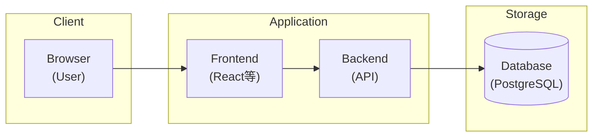
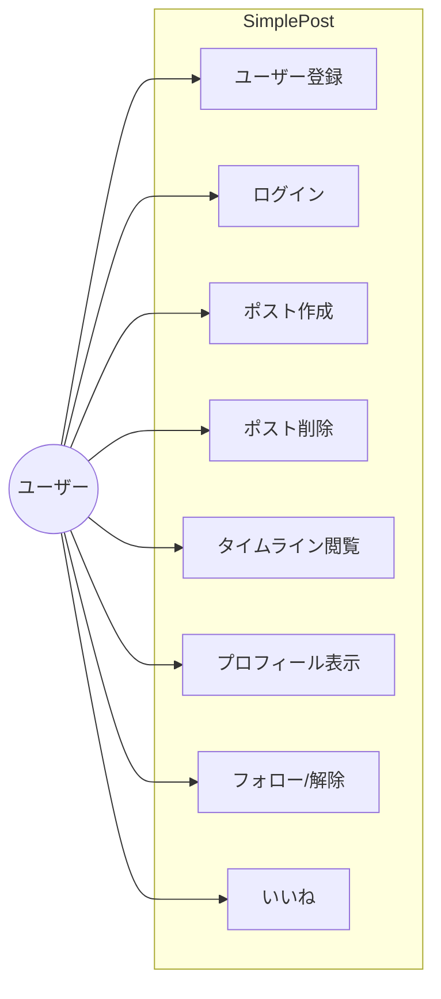
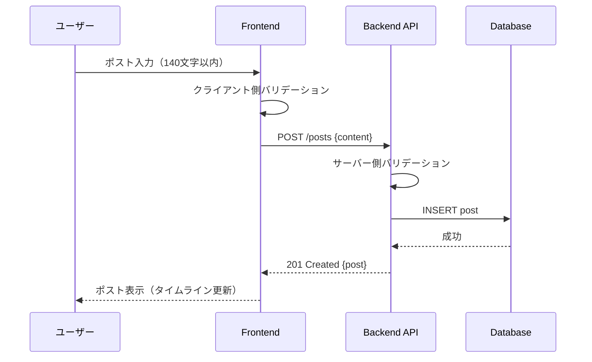
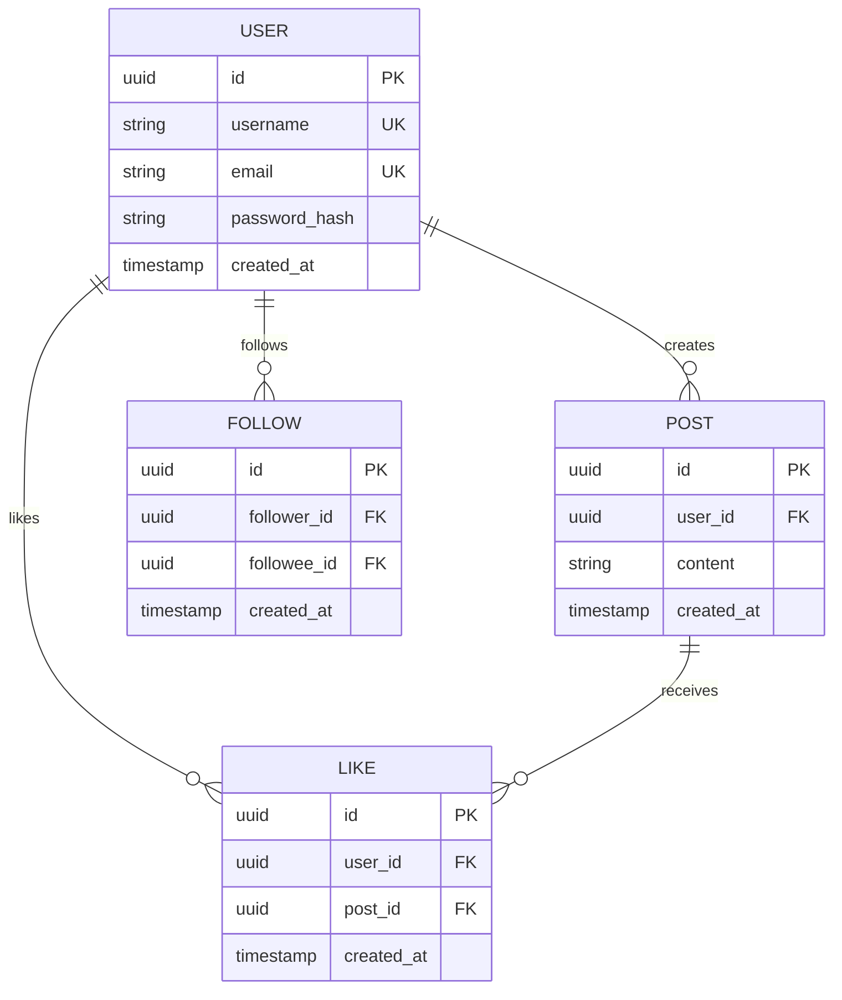

# ソフトウェア要求仕様書: SimplePost（X.com シンプル版）

**バージョン**: 1.0  
**作成日**: 2025-12-30  
**準拠規格**: ISO/IEC/IEEE 29148:2018

---

## 1. はじめに

### 1.1 目的 (Purpose)

本文書は、X.com（旧Twitter）の核となる機能を簡易的に再現したマイクロブログサービス「SimplePost」のソフトウェア要求仕様書（SRS）である。開発チームが実装に着手できるレベルの要件を定義する。

### 1.2 範囲 (Scope)

**システムが行うこと:**

- ユーザー登録・認証
- 短文投稿（ポスト）の作成・閲覧・削除
- タイムライン表示
- フォロー/フォロー解除
- いいね機能

**システムが行わないこと（スコープ外）:**

- リポスト（リツイート）機能
- ダイレクトメッセージ
- 画像/動画投稿
- 検索機能
- 通知機能
- 課金/サブスクリプション
- モバイルアプリ（Webのみ）

### 1.3 定義・頭字語

| 用語 | 定義 |
|------|------|
| ポスト | ユーザーが投稿する短文メッセージ（最大140文字） |
| タイムライン | フォロー中ユーザーのポストを時系列で表示するフィード |
| フォロー | 他ユーザーのポストを購読する行為 |

---

## 2. 全体説明

### 2.1 製品の展望 (Product Perspective)

SimplePostは独立したWebアプリケーションとして構築する。外部サービスへの依存は最小限とし、認証は自前で実装する。

### 2.2 ユーザー特性 (User Characteristics)

| ペルソナ | 特性 |
|----------|------|
| 一般ユーザー | 短文で気軽に発信したい個人。SNS経験あり。 |
| 閲覧専用ユーザー | 投稿せず他者のポストを閲覧するのみ。 |

### 2.3 制約事項 (Constraints)

- **実装規模**: GitHub Issue 5個分程度の作業量
- **技術スタック**: 未定（設計フェーズで決定）
- **予算**: 無料で運用

---

## 3. 具体的な要求事項 (Specific Requirements)

### 3.1 機能要件 (Functional Requirements)

#### **[REQ-FUN-001] ユーザー登録**

- **概要**: 新規ユーザーがアカウントを作成できる
- **入力**: ユーザー名、メールアドレス、パスワード
- **処理**: 入力値のバリデーション、重複チェック、アカウント作成
- **出力**: 登録完了画面、または エラーメッセージ
- **要件**:
  - システムはユーザー名（3〜20文字、半角英数字とアンダースコアのみ）を受け付けなければならない
  - システムはメールアドレスの形式を検証しなければならない
  - システムは8文字以上のパスワードを要求しなければならない
  - システムは重複するユーザー名・メールアドレスを拒否しなければならない

#### **[REQ-FUN-002] ログイン/ログアウト**

- **概要**: 登録済みユーザーが認証を行う
- **入力**: メールアドレス（またはユーザー名）、パスワード
- **処理**: 認証情報の照合、セッション生成/破棄
- **出力**: ホーム画面へのリダイレクト、または エラーメッセージ
- **要件**:
  - システムはログイン成功時にセッションを生成しなければならない
  - システムはログアウト時にセッションを無効化しなければならない

#### **[REQ-FUN-003] ポスト作成**

- **概要**: ユーザーが短文を投稿する
- **入力**: 本文（最大140文字）
- **処理**: 文字数バリデーション、ポスト保存、タイムスタンプ付与
- **出力**: 投稿完了、タイムラインへの反映
- **要件**:
  - システムは認証済みユーザーのみポスト作成を許可しなければならない
  - システムは140文字を超える投稿を拒否しなければならない
  - システムは空白のみの投稿を拒否しなければならない
  - システムはポストに作成日時を自動付与しなければならない

#### **[REQ-FUN-004] ポスト削除**

- **概要**: 自分のポストを削除する
- **入力**: ポストID
- **処理**: 所有権確認、ポスト削除
- **出力**: 削除完了、タイムラインからの除去
- **要件**:
  - システムは投稿者本人のみ削除を許可しなければならない
  - システムは削除時に確認ダイアログを表示することが望ましい

#### **[REQ-FUN-005] タイムライン表示**

- **概要**: フォロー中ユーザーのポストを時系列で表示
- **入力**: なし（認証ユーザーのセッション情報を使用）
- **処理**: フォロー中ユーザーのポストを取得、新しい順にソート
- **出力**: ポスト一覧（投稿者名、本文、投稿日時、いいね数）
- **要件**:
  - システムはフォロー中ユーザーと自分のポストを表示しなければならない
  - システムはポストを新しい順（降順）で表示しなければならない
  - システムは20件ずつページング表示しなければならない
  - システムは無限スクロールまたはページネーションで追加読み込みを提供することが望ましい

#### **[REQ-FUN-006] ユーザープロフィール表示**

- **概要**: 特定ユーザーの情報とポスト一覧を表示
- **入力**: ユーザーID またはユーザー名
- **処理**: ユーザー情報取得、当該ユーザーのポスト取得
- **出力**: プロフィール画面（ユーザー名、フォロー/フォロワー数、ポスト一覧）
- **要件**:
  - システムはユーザー名、フォロー数、フォロワー数を表示しなければならない
  - システムは当該ユーザーのポストを新しい順で表示しなければならない

#### **[REQ-FUN-007] フォロー/フォロー解除**

- **概要**: 他ユーザーをフォローまたはフォロー解除する
- **入力**: 対象ユーザーID
- **処理**: フォロー関係の作成/削除
- **出力**: フォロー状態の更新、UI反映
- **要件**:
  - システムは自分自身をフォローすることを禁止しなければならない
  - システムは既にフォロー中のユーザーに対してフォロー解除ボタンを表示しなければならない
  - システムはフォロー/フォロワー数をリアルタイムで更新することが望ましい

#### **[REQ-FUN-008] いいね機能**

- **概要**: ポストに「いいね」を付ける/外す
- **入力**: ポストID
- **処理**: いいね状態のトグル
- **出力**: いいね状態の更新、いいね数の反映
- **要件**:
  - システムは1ユーザーにつき1ポストあたり1回のいいねのみ許可しなければならない
  - システムは再度操作時にいいねを解除（トグル動作）しなければならない
  - システムはいいね数をポストに表示しなければならない

---

### 3.2 外部インターフェース要件

#### **UI/UX方針**

- シンプルで直感的な操作を優先
- レスポンシブデザイン（PC/モバイルブラウザ対応）
- 主要操作は3クリック以内で到達可能とすることが望ましい

#### **API設計**

- RESTful API として設計
- JSON形式でデータ交換

---

### 3.3 品質要件 / 非機能要件 (Quality Requirements)

#### **[REQ-PER-001] 性能 (Performance)**

- システムはタイムライン取得を2秒以内に完了しなければならない
- システムはポスト作成を1秒以内に完了しなければならない

#### **[REQ-SEC-001] セキュリティ (Security)**

- システムはパスワードをハッシュ化して保存しなければならない（bcrypt等）
- システムはセッショントークンを安全に管理しなければならない
- システムはCSRF対策を実装しなければならない
- システムはXSS対策として入力値のサニタイズを行わなければならない

#### **[REQ-REL-001] 信頼性 (Reliability)**

- システムは99%以上の可用性を目標とすることが望ましい

#### **[REQ-MNT-001] 保守性 (Maintainability)**

- システムはモジュール化された構成とし、機能追加が容易であることが望ましい
- システムはユニットテストカバレッジ80%以上を維持することが望ましい

---

## 4. 検証基準 (Verification Criteria)

| 要件ID | 検証方法 | 受け入れ基準 |
|--------|----------|--------------|
| REQ-FUN-001 | 手動テスト | 有効な入力で登録成功、無効な入力でエラー表示 |
| REQ-FUN-002 | 自動テスト | 正常系でホームへリダイレクト、異常系でエラー |
| REQ-FUN-003 | 自動テスト | 140文字以内で投稿成功、141文字以上で拒否 |
| REQ-FUN-004 | 手動テスト | 自分のポストのみ削除可能 |
| REQ-FUN-005 | 自動テスト | フォロー中ユーザーのポストが降順で表示 |
| REQ-FUN-006 | 手動テスト | プロフィール情報とポスト一覧が正しく表示 |
| REQ-FUN-007 | 自動テスト | フォロー/解除でフォロワー数が増減 |
| REQ-FUN-008 | 自動テスト | いいねトグル動作、カウント増減確認 |
| REQ-PER-001 | 負荷テスト | タイムライン取得 < 2秒 |
| REQ-SEC-001 | コードレビュー | パスワードハッシュ化確認 |

---

## 5. 付録 (Appendices)

### 5.1 ユースケース図

### 5.2 ポスト作成シーケンス図

### 5.3 データモデル（ER図）

---

## 6. 形式手法 (Formal Methods)

### 6.1 ポスト作成の事前条件・事後条件（Z記法風）

$$
\begin{aligned}
& \textbf{CreatePost} \\
& \Delta Posts \\
& user? : User \\
& content? : String \\
& \\
& \text{pre:} \\
& \quad user? \in AuthenticatedUsers \\
& \quad 1 \leq |content?| \leq 140 \\
& \\
& \text{post:} \\
& \quad \exists p : Post \bullet \\
& \quad\quad p.author = user? \land \\
& \quad\quad p.content = content? \land \\
& \quad\quad p.createdAt = now \land \\
& \quad\quad Posts' = Posts \cup \{p\}
\end{aligned}
$$

### 6.2 フォロー関係の不変条件

$$
\begin{aligned}
& \forall u : User \bullet (u, u) \notin Follows \\
& \text{（自分自身をフォローすることはできない）}
\end{aligned}
$$

---

## 改訂履歴

| バージョン | 日付 | 変更内容 |
|------------|------|----------|
| 1.0 | 2025-12-30 | 初版作成 |
